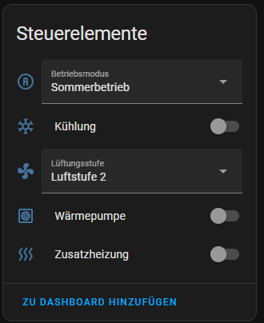

## ESPHome-Komponenten für WR3223-Lüftungs-/Wärmepumpensteuerung
Mit diesem Projekt kannst du eine Hermes WR 3223-basierte Heizungs- bzw. Lüftungssteuerung (Wärmepumpe, Lüfterstufen, Zusatzheizung etc.) über ESPHome in Home Assistant einbinden.

### Funktionen im Überblick
- Abfragen von Temperaturwerten (z.B. Verdampfer, Kondensator, Außenluft etc.)
- Erfassen und Überwachen diverser Relaiszustände (Kompressor, Bypass, Zusatzheizung etc.)
- Setzen von Lüfterstufen
- Aktivieren/Deaktivieren von Wärmepumpe und Zusatzheizung
- Auslesen von Fehler- und Statusmeldungen
- ~~Einstellen der Zuluftsolltemperatur und anderer Parameter~~
- Komfortable Ansteuerung direkt aus Home Assistant

## Installation und Einbindung
1. Vorbereitung  
Du benötigst ESPHome (meist über Home Assistant Add-on installiert oder eigenständig nutzbar).  
Dein ESP32/ESP8266 muss mit der WR3223-Steuerung seriell verbunden sein (UART).  
Achte dabei auf:  
Baudrate (i. d. R. 9600)  
Datenbits / Parität / Stopbits (hier im Projekt: 7 Datenbits, EVEN-Parität, 1 Stoppbit)  
Richtige Zuordnung von TX-/RX-Pins am Mikrocontroller (siehe Bild):  
  
3. Externe Komponente einbinden  
Damit ESPHome diese Custom Components direkt aus diesem Git-Repository lädt, kannst du in deiner esphome:-Konfiguration den Bereich für externe Komponenten konfigurieren.  
Dafür fügst du in deiner YAML-Datei Folgendes hinzu (diese Einbindung ist ein Beispiel; ggf. anpassen):  
```yaml
external_components:
  - source:
      type: git
      url: https://github.com/schmurgel-tg/esphome-components
      # Optional: bestimmter Branch oder Tag, z.B.:
      # ref: main
    components: [wr3223]
    refresh: always
```

## Minimalkonfiguration mit alle Sensoren mit Standardwerten:
```yaml
external_components:
  - source:
      type: git
      url: https://github.com/schmurgel-tg/esphome-components

uart:
  - id: uart_bus
    tx_pin: GPIO19
    rx_pin: GPIO18
    baud_rate: 9600
    data_bits: 7
    parity: EVEN
    stop_bits: 1

wr3223:
  uart_id: uart_bus

sensor:
  - platform: wr3223

binary_sensor:
  - platform: wr3223

select:
  - platform: wr3223

switch:
  - platform: wr3223

number:
  - platform: wr3223
```

## Minimalkonfig Screenshots:



## Detailkonfiguration
```yaml

#Hauptkomponente
wr3223:
  uart_id: uart_bus  
  # anzahl der Versuche die gespeicherten Mode/Status Werte wiederherzustellen OnStartup 
  # defaul = 4, wir pro Update (alls 5s) der WR3223 Hauptkomponeten veruscht, 
  # ein Wiederherstellung kann nur erfolgen, wenn das Bedienteil nicht aktiv ist
  restore_attempts: 4 


# Sensoren
sensor:
  - platform: wr3223
    sensors: # hier können alle Sensoren mit bekannten Kommandos angepasst oder deaktiviert werden
      T1:
        name: "Verdampfertemperatur" # z.B. der Name kann überschrieben werden
      T2:
        deactivate: true # wird ein Kommando nicht benötigt, kann es deaktiviert werden
      T3:
        update_interval: "15s" # Der standard Update-Intervall liegt für alle bei 60s, dieser kann hier angepasst werden
    sensors_custom: # In diesem Bereich können eigene Kommando hinzugefügt werden (siehe Kommandoliste für WR-3223)
      - command: "XZ"
        name: "Custom-Kommand"
        unit_of_measurement: V
        device_class: temperature
      - command: "LS"
        name: "Aktuelle Luftstufe"
        unit_of_measurement: Level             

# Binär-Sensoren
binary_sensor:
  - platform: wr3223
    relais_sensors:
      zusatzheizung:
        deactivate: true # Dieser Sensor wird nicht erstellt
      kompressor:
        name: "Anderer Name"
        entity_category: "diagnostic"
        device_class: "power"  # Falls gewünscht, kann die `device_class` überschrieben werden        
      bypass:
        name: "Relais: Bypass"
        entity_category: "config"
```
Die Relais-Komponente wird unabhängig von diesem Abschnitt automatisch
erstellt. Hier lassen sich lediglich Sensoren für ausgewählte Relais
anlegen oder anpassen.

# Lüftungsstufe konfigurieren

Die WR3223-Komponente erstellt standardmäßig ein `select` zur Wahl der Lüftungsstufe. 
Die vier Optionen `AUS`, `Luftstufe 1`, `Luftstufe 2` und `Luftstufe 3` sind bereits vorkonfiguriert. 

Soll das Select angepasst oder ganz abgeschaltet werden, kann dies über den Bereich `selects:` erfolgen:

```yaml
select:
  - platform: wr3223
    selects:
      ventilation_level:
        # deactivate: true  # falls das Dropdown nicht benötigt wird
        options: ["AUS", "1", "2", "3"] # optionales überschreiben der Anzeigwerte der Luftstufen
        # wird automatisch über die Status-Komponente aktualisiert -> kein UpdateIntervall
```

# Status-Schalter

Neben dem Dropdown für die Lüftungsstufe können auch die Ventilatorstellwerte
der einzelnen Stufen über `number`-Slider angepasst werden. Die Werte liegen
zwischen 40 % und 100 %.

```yaml
number:
  - platform: wr3223
    numbers:
      vent_level_1_speed:
        name: "Luftstufe 1 [%]"
      vent_level_2_speed:
        name: "Luftstufe 2 [%]"
      vent_level_3_speed:
        name: "Luftstufe 3 [%]"
```

Zusätzlich legt die Komponente drei Schalter an, mit denen sich Wärmepumpe,
Zusatzheizung und Kühlung ein- oder ausschalten lassen. Bei Bedarf können die
Schalter deaktiviert werden:

```yaml
switch:
  - platform: wr3223
    switches:
      heat_pump:
        # deactivate: true
      additional_heating:
        # deactivate: true
      cooling:
        # deactivate: true
```

# Speicherung und Wiederherstellung des Betriebszustands

Die `wr3223`-Komponente liest beim Start automatisch den zuletzt gespeicherten Modus sowie den Status der Schalter (z. B. Wärmepumpe, Zusatzheizung, Kühlung) aus dem Flash-Speicher (NVS) und stellt diese wieder her. Solange der Sensor `Bedienteil aktiv` auf `true` steht, wird alle fünf Sekunden ein Relais‑Update angestoßen. Sind nach einer frei wählbaren Anzahl von Versuchen (Standard: vier) noch immer Schreibrechte gesperrt, wird der Startvorgang abgebrochen. Sobald `bedienteil_aktiv` auf `false` wechselt, schreiben Status- und Mode-Komponente ihre gespeicherten Werte einmalig an die Anlage und der *fresh start* endet.

Damit Änderungen auch nach einem Stromausfall oder Neustart erhalten bleiben, müssen sie explizit gespeichert werden. Hierfür stehen zwei Buttons zur Verfügung:

**Config speichern** (save_state): Schreibt den aktuellen Modus und den Zustand der Status-Schalter dauerhaft in den Flash-Speicher.

**Config laden** (restore_state): Stellt die zuletzt gespeicherten Werte aus dem Flash-Speicher wieder her (nützlich z. B. beim Zurücksetzen oder zur manuellen Wiederherstellung).

Diese Buttons sind standardmäßig aktiviert und müssen nicht explizit konfiguriert werden. Die unten gezeigte Konfiguration dient zur optionalen Individualisierung (z. B. benutzerdefinierte Icons, Namen oder um die Buttons zu deaktivieren).

```yaml
button:
  - platform: wr3223
    buttons:
      save_state:
        name: "Konfiguration speichern"
        icon: mdi:content-save
      restore_state:
        name: "Konfiguration laden"
        icon: mdi:restore
```

**Hinweis:** Einstellungen wie individuelle Lüfterstufen-Drehzahlen oder andere "number"-Werte von der Anlage selbst gespeichert.


 "Anschlussbeispiel")  

